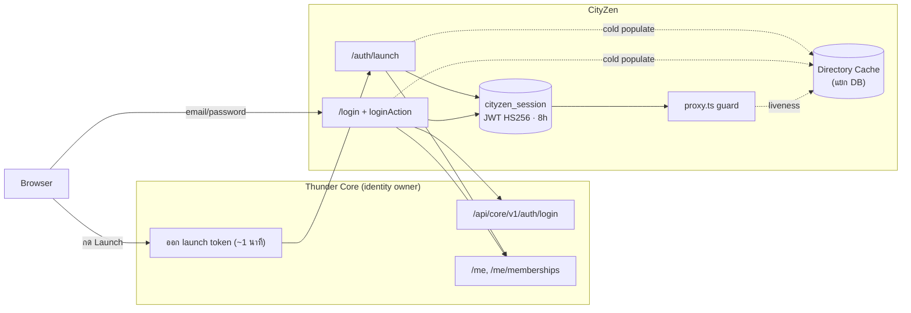
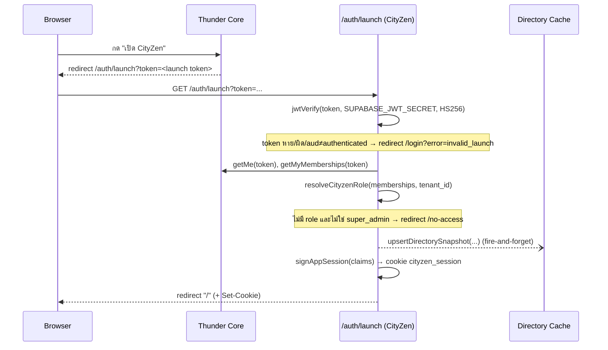
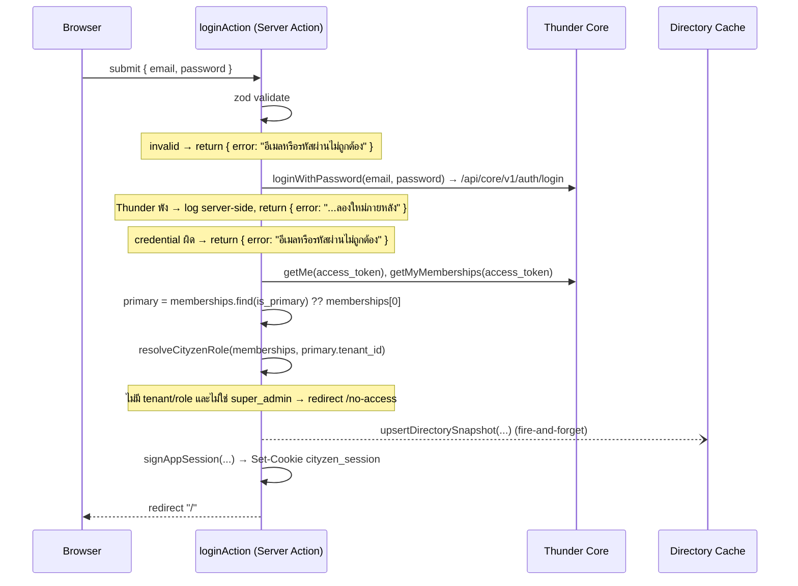
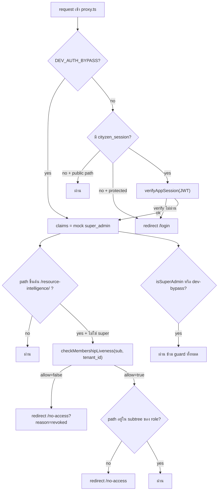

# AUTHENTICATION_FLOW — Authentication & Authorization Flows ของ CityZen

> **สถานะ:** ณ วันที่ 13 ก.ค. 2026 (branch `fix/webhook`)
> **อ้างอิงโค้ด:** `src/proxy.ts`, `src/lib/app-session.ts`, `src/lib/roles.ts`, `src/lib/thunder.ts`, `src/lib/directory-cache.ts`, `src/features/auth/actions.ts`, `src/app/(auth)/auth/launch/route.ts`, `src/app/api/webhooks/thunder/route.ts`
> **เอกสารอ้างอิง:** [`AUTH_CONTRACT.md`](AUTH_CONTRACT.md) = สัญญากลาง Thunder↔CityZen (role table / token schema / cookie security แบบ canonical) — ถ้าค่าในไฟล์นี้ขัดกัน ให้ยึดโค้ด แล้วแก้ทั้งสองไฟล์ใน PR เดียว

---

## 0. สิ่งที่ระบบนี้ **ไม่มี**

CityZen **ไม่ได้**ใช้ auth flow แบบ Supabase textbook ทั่วไป :

| Thunder Core                                   | Cityzen                                                                                     |
| ---------------------------------------------- | ------------------------------------------------------------------------------------------- |
| Sign-up / สมัครสมาชิก + email verification     | **ไม่มี** — identity เป็นของ Thunder Core ทั้งหมด (`RegisterCard` เป็น UI ค้าง ยังไม่ wire) |
| Supabase `signInWithPassword`                  | **ไม่ใช้** — login ตรงยิงไป Thunder Core `/api/core/v1/auth/login`                          |
| Access token (15 นาที) + Refresh token (7 วัน) | **ไม่มี refresh token** — มีแค่ `cityzen_session` JWT อายุ 8 ชม. หมดแล้ว login ใหม่         |
| Middleware คอย refresh access token            | **ไม่มี** — `proxy.ts` แค่ verify `cityzen_session`                                         |
| Supabase `app_metadata` เก็บ tenant/role       | **ไม่ใช้** — role มาจาก Thunder membership resolve ตอน auth                                 |
| API ตอบ 401/403 JSON ทุกที่                    | **UI ใช้ redirect** — 401/403 มีเฉพาะ surface ที่เป็น API จริง (webhook) ดู §8              |

---

## 1. ภาพรวมสถาปัตยกรรม

- **Thunder Core** (repo แยก) = เจ้าของ **identity, tenant, membership, role** — CityZen เรียกผ่าน `/api/core/v1`
- **CityZen** = เจ้าของ **session ของตัวเอง (`cityzen_session`)** + **RBAC ฝั่ง UI**
- มี **2 ทางเข้า** แต่**จบเหมือนกันเสมอ** ที่ cookie `cityzen_session`:
  1. **Launch จาก Thunder** — ผู้ใช้กดเปิดแอปจากหน้า tenant overview ของ Thunder → ได้ launch token อายุสั้น (~1 นาที) → `/auth/launch`
  2. **Login ตรง** — เข้าหน้า `/login` ของ CityZen เอง → กรอก email/password → `loginAction` คุยกับ Thunder Core
- ทุก request ถัดไปถูกยาม (guard) ที่ **`proxy.ts`** (Next.js middleware): verify session → liveness check → prefix guard



---

## 2. Flow 1 — Launch จาก Thunder (`/auth/launch`)

ผู้ใช้ login ใน Thunder อยู่แล้ว แล้วกดเปิด CityZen จาก tenant overview — Thunder ออก **launch token** (Supabase JWT, `aud=authenticated`, อายุ ~1 นาที, พก `tenant_id` มาด้วย) แล้ว redirect มาที่ `/auth/launch?token=...`



ขั้นตอนตามโค้ด (`src/app/(auth)/auth/launch/route.ts`):

1. ไม่มี `token` → redirect `/login`
2. `jwtVerify` ด้วย `SUPABASE_JWT_SECRET` (HS256); ถ้า verify ไม่ผ่าน หรือ `payload.aud !== "authenticated"` → redirect `/login?error=invalid_launch`
3. ดึง `tenant_id` จาก payload แล้วเรียก `getMe(token)` + `getMyMemberships(token)` จาก Thunder
   - ถ้าเรียกพัง → จับ error เงียบ ๆ, `memberships` เป็น `undefined` → **fail closed** (ไปตกที่ข้อ 4)
4. **RBAC จาก membership roles เท่านั้น** — `resolveCityzenRole(memberships, tenantId)` + `isThunderSuperAdmin(...)`
   - **ห้ามใช้ `payload.role`** จาก launch token (นั่นคือ _platform role_ ของ Thunder)
   - ไม่มี role และไม่ใช่ super_admin → redirect `/no-access`
5. **Cold populate** Directory Cache — `upsertDirectorySnapshot(...)` แบบ **fire-and-forget** (`void ....catch(...)`) → cache write ต้องไม่ block การ sign-in (ดู §5.4 / §9)
6. `signAppSession(...)` → เซ็น `cityzen_session` → `setAppSessionCookie(...)` → redirect `"/"`
   - super_admin ไม่มี tenant role → `role` claim fallback เป็น `"manager"` (แต่ `isSuperAdmin` ข้าม prefix guard อยู่แล้ว)

---

## 3. Flow 2 — Login ตรง (`/login` → `loginAction`)

ทางเข้าสำหรับคนที่ไม่ได้มาจาก Thunder — หน้า `/login` เป็น Server Action (`src/features/auth/actions.ts` → `loginAction`) ซึ่งใช้ Thunder Core เป็น identity gateway (**ไม่ใช่ Supabase**)



ต่างจาก Launch flow ตรงที่ **login ตรงไม่มี tenant hint** → เลือก tenant จาก **primary membership** (`is_primary`, fallback ตัวแรก) แล้ว resolve role แบบเดียวกัน จากนั้นจบเหมือนกัน: cold populate → `cityzen_session` → redirect `"/"`

> **การไม่ leak error:** ทุก error จาก Thunder/Supabase ถูก log ฝั่ง server แล้วส่งข้อความไทยกลาง ๆ ให้ client เท่านั้น (ตามกฎ CLAUDE.md) — ไม่มี raw error หลุดออก frontend

---

## 4. Flow 3 — Guard ต่อทุก request (`proxy.ts`)

หลังมี `cityzen_session` แล้ว ทุก request (ยกเว้น static asset) ผ่าน `proxy.ts`



**Public paths** (เข้าได้โดยไม่ต้องมี session): `/login`, `/auth/launch`, `/auth/login`, `/no-access`, `/api/webhooks/thunder`
(webhook self-authenticate ด้วย `WEBHOOK_SECRET` — guard ห้าม redirect มันไป `/login`)

**ลำดับการ secure:**

1. **มี session ไหม** — ไม่มี `cityzen_session` + เป็น path ที่ป้องกัน → redirect `/login`; verify JWT ไม่ผ่าน → `/login`
2. **god mode / dev bypass** — `claims.isSuperAdmin` หรือ `DEV_AUTH_BYPASS` หรือ path ไม่ใช่ `/resource-intelligence/*` → ผ่านเลย
3. **Liveness check** (ADR 0004) — query `membership_directory_cache` row `(sub, tenant_id)`: `status !== 'active'` → redirect `/no-access?reason=revoked` (ดู §6.3 + §9)
4. **Prefix guard** — role ปัจจุบัน (resolve สดจาก `role_codes` ใน cache; fallback = `role` ใน JWT) ต้องตรงกับ subtree ของตัวเอง ไม่งั้น redirect `/no-access`

---

## 5. Session & Token

### 5.1 `cityzen_session` (App Session)

- **ชนิด:** JWT **HS256**, เซ็นด้วย `APP_SESSION_SECRET` (`src/lib/app-session.ts`)
- **อายุ:** **8 ชั่วโมง** (`setExpirationTime("8h")`) — หมดแล้ว **login ใหม่** (ไม่มี refresh)
- **Claims จริง** (`AppSessionClaims`):

  | claim          | ความหมาย                                                                                                     |
  | -------------- | ------------------------------------------------------------------------------------------------------------ |
  | `sub`          | Thunder user id                                                                                              |
  | `email`        | อีเมลผู้ใช้                                                                                                  |
  | `tenant_id`    | tenant ที่ resolve role มา                                                                                   |
  | `role`         | CityZen role (`manager` / `executive_viewer` / `operator`) — **fallback/แสดงผล**; authz จริงดู liveness §6.3 |
  | `isSuperAdmin` | Thunder platform super_admin → god mode (ข้าม guard)                                                         |
  | `app_name`     | ชื่อ sub-app (จาก launch token, optional)                                                                    |

  > **หมายเหตุ:** snapshot ของ profile/memberships **ถูกถอดออกจาก cookie แล้ว** (Phase 2) — display data (ชื่อ/avatar/ชื่อ tenant) ย้ายไปอ่านจาก Directory Cache แทน กัน cookie บวม

### 5.2 Cookie security (`setAppSessionCookie`)

| attribute  | ค่า                     | เหตุผล                                                                               |
| ---------- | ----------------------- | ------------------------------------------------------------------------------------ |
| `httpOnly` | `true`                  | JS ฝั่ง client อ่านไม่ได้ กัน XSS ขโมย token                                         |
| `sameSite` | `lax`                   | กัน CSRF ข้ามไซต์ แต่ยอมให้ top-level navigation (จำเป็นสำหรับ redirect จาก Thunder) |
| `secure`   | `true` เฉพาะ production | ส่งผ่าน HTTPS เท่านั้นบน prod; dev (http) ยังใช้ได้                                  |
| `path`     | `/`                     | ใช้ทั้งแอป                                                                           |
| `maxAge`   | `28800` (8 ชม.)         | ตรงกับอายุ JWT                                                                       |

### 5.3 Secrets — ใครทำอะไร (แยก failure domain)

| env                                 | ใช้ทำอะไร                                                                    | ใครถือคู่                                                                     |
| ----------------------------------- | ---------------------------------------------------------------------------- | ----------------------------------------------------------------------------- |
| `SUPABASE_JWT_SECRET`               | **verify launch token** จาก Thunder (`/auth/launch`)                         | ตรงกับ Supabase auth project ของ Thunder                                      |
| `APP_SESSION_SECRET`                | **เซ็น/verify `cityzen_session`**                                            | CityZen ถือคนเดียว                                                            |
| `WEBHOOK_SECRET`                    | verify HMAC ของ webhook Thunder→CityZen (§9)                                 | ตรงกับ Thunder — **แยกจาก auth** โดยตั้งใจ (secret webhook รั่วไม่กระทบ auth) |
| `THUNDER_CORE_API_URL`              | base URL ของ Thunder Core (`/api/core/v1`)                                   | —                                                                             |
| `CITYZEN_DIRECTORY_DB_URL` / `_KEY` | ต่อ Directory Cache DB (แยกจาก auth project); ไม่ตั้ง = cache ops เป็น no-op | —                                                                             |

### 5.4 Directory Cache (cold populate ตอน auth)

ทั้ง 2 flow เขียน cache แบบ **fire-and-forget** ตอน sign-in สำเร็จ — `upsertDirectorySnapshot(profile, memberships, token)` mirror snapshot ของ Thunder (user / tenant / membership / department) ลง cache **ตรง ๆ ไม่ใช่ webhook** เป็น **cold populate** เพื่อรับประกันว่ามี cache row ให้ liveness check ใช้ การเขียนพลาดไม่ทำให้ login ล้ม (`.catch` log เฉย ๆ, login ครั้งหน้า populate ใหม่)

> ถ้ายังไม่ได้ตั้ง `CITYZEN_DIRECTORY_DB_URL/KEY` → ทุก cache op เป็น **no-op** และ auth ยังทำงานปกติ (build-now-plug-link-later)

---

## 6. Authorization (RBAC)

### 6.1 3 CityZen roles

`manager` · `executive_viewer` · `operator` (`src/lib/roles.ts`) — แยกจาก platform role ของ Thunder

### 6.2 Role mapping (Thunder `roles.code` → CityZen role)

| Thunder `roles.code`                                 | CityZen role       | หมายเหตุ                                                         |
| ---------------------------------------------------- | ------------------ | ---------------------------------------------------------------- |
| `department_admin`, `admin_company`, `company_admin` | `manager`          | รับทั้งสามแบบ (seed เก่า/ใหม่)                                   |
| `executive_viewer`                                   | `executive_viewer` |                                                                  |
| `operator*` (prefix)                                 | `operator`         | ครอบ `operator`, `operator_supervisor`, …                        |
| `super_admin`                                        | _(ไม่ map)_        | เช็คแยกเป็น `isSuperAdmin` (god mode); role fallback = `manager` |
| `viewer_auditor` / อื่น ๆ                            | _(ไม่มีสิทธิ์)_    | → `/no-access` (fail closed)                                     |

**Priority เมื่อ 1 membership มีหลาย role:** `manager` > `executive_viewer` > `operator`

**Home ต่อ role** (`ROLE_HOME`): manager → `/resource-intelligence/manager/daily-brief` · executive → `/resource-intelligence/executive/daily-brief` · operator → `/resource-intelligence/operator/tasks`

### 6.3 Prefix guard + Liveness = authorization state จริง

- **Prefix guard:** แต่ละ role เข้าได้เฉพาะ subtree ของตัวเอง (`/resource-intelligence/<role>`) เท่านั้น
- **Liveness check** (ADR 0004): **สถานะ authz จริงคือ cache row ปัจจุบัน ไม่ใช่ `role` ใน JWT ที่ freeze ไว้ 8 ชม.**
  - `status !== 'active'` (revoked/suspended) → เด้ง `/no-access`
  - role resolve สดจาก `role_codes` ใน cache → **เปลี่ยน role มีผลทันที** ไม่ต้องรอ JWT หมดอายุ
  - ห่อใน seam เดียว (`checkMembershipLiveness`) เพื่อสลับกลยุทธ์ (TTL / short-token) ได้ภายหลัง

---

## 7. Logout

`logoutAction` (Server Action, `src/features/auth/actions.ts`):

```
cookies().delete("cityzen_session") → redirect("/login")
```

ลบ cookie ฝั่ง cityzen อย่างเดียว — ไม่มี refresh token ให้ revoke และไม่ยุ่งกับ session ของ Thunder (คนละระบบ) เรียกจากปุ่มใน `OverviewClient` / `SideBarBlock`

---

## 8. Error handling & redirect — กฎตาม surface

**หลักการ:** error shape ขึ้นกับว่า _ผู้เรียกคาดหวังอะไร_ ไม่ใช่ตอบ 401/403 JSON ทุกที่

| Surface                                               | ผู้เรียก             | ตอบ                                                     |
| ----------------------------------------------------- | -------------------- | ------------------------------------------------------- |
| **Page navigation** (`/resource-intelligence/*`, ฯลฯ) | browser เปิดหน้าเว็บ | **redirect** (307) → `/login` หรือ `/no-access`         |
| **Server Action** (`loginAction`)                     | form submit (RPC)    | return `{ error: "<ข้อความไทย>" }` หรือ `redirect(...)` |
| **API route** (`/api/webhooks/thunder`)               | โค้ดที่รอ response   | **HTTP status จริง** — ดูตารางล่าง                      |

> **ทำไม page ใช้ redirect ไม่ใช่ 401 JSON:** ถ้าตอบ `{"error":"Unauthorized"}` ให้ browser ที่กำลังเปิดหน้าเว็บ ผู้ใช้จะเห็น JSON ดิบบนจอแทนหน้า login — 401/403 มีไว้ตอบ fetch/XHR ที่รอ data ไม่ใช่ตอบคนที่ navigate เข้าหน้าเพจ ตอนนี้ CityZen ยังไม่มี data-API route ฝั่ง client (นอกจาก webhook) จึงยังไม่ต้องมี 401 JSON layer

**Redirect / status ที่เกิดจริง:**

| จุด                           | เงื่อนไข                                    | ผล                                                      |
| ----------------------------- | ------------------------------------------- | ------------------------------------------------------- |
| `proxy.ts`                    | ไม่มี/verify session ไม่ผ่าน (path ป้องกัน) | redirect `/login`                                       |
| `proxy.ts`                    | liveness `allow=false`                      | redirect `/no-access?reason=revoked`                    |
| `proxy.ts`                    | prefix ไม่ตรง role                          | redirect `/no-access`                                   |
| `/auth/launch`                | token หาย/ผิด/`aud`≠authenticated           | redirect `/login[?error=invalid_launch]`                |
| `/auth/launch`, `loginAction` | ไม่มี role และไม่ใช่ super_admin            | redirect `/no-access`                                   |
| `loginAction`                 | credential ผิด / validate fail              | `{ error: "อีเมลหรือรหัสผ่านไม่ถูกต้อง" }`              |
| `loginAction`                 | Thunder พัง                                 | `{ error: "เข้าสู่ระบบไม่สำเร็จ กรุณาลองใหม่ภายหลัง" }` |
| `/api/webhooks/thunder`       | ไม่มี bearer / signature ผิด                | **401**                                                 |
| `/api/webhooks/thunder`       | `WEBHOOK_SECRET` ไม่ตั้ง / cache write พัง  | **500** (Thunder retry/redeliver)                       |
| `/api/webhooks/thunder`       | สำเร็จ                                      | **200**                                                 |

**กฎเหล็ก:** ไม่ส่ง raw error จาก Thunder/Supabase ออก frontend — log ฝั่ง server, ส่งข้อความกลาง ๆ

---

## 9. ภาคผนวก A — การเพิกถอนสิทธิ์ (Webhook Thunder → CityZen)

Revocation/role-change **ไม่ได้เกิดตอน user login** แต่มาจาก event ฝั่ง Thunder เมื่อ admin เปลี่ยน/ถอนสิทธิ์ — Thunder ยิง webhook เข้า `/api/webhooks/thunder` (คนละทิศกับ cold populate ใน §5.4)

- **Auth ของ webhook:** Bearer JWT เซ็นด้วย `WEBHOOK_SECRET` → `jwtVerify` (ไม่ผ่าน = 401)
- **Warm update:** `applyMembershipEvent(claims)` upsert `membership_directory_cache` จาก payload ที่ self-describing (มี `status` + `role_codes` มาเลย ไม่ต้อง pull `/me` — ADR 0002) รองรับ `membership.revoked/created/updated`, `user.updated`, `tenant.updated`, `org.created/updated/deleted`
- **ผลต่อ authz:** ครั้งถัดไปที่ user คนนั้น request → §6.3 liveness check เห็น `status='suspended'` → เด้ง `/no-access` **ทันที** ไม่ต้องรอ JWT 8 ชม. หมด
- **Reliability:** cache write พัง → ตอบ 500 → Thunder retry/backoff redeliver

> รายละเอียด webhook fan-out / signing / Directory Cache schema เต็ม ๆ อยู่นอกขอบเขตเอกสารนี้ (ดู `THUNDER_CITYZEN_INTEGRATION_PLAN.md` และ CONTEXT.md)

---

## 10. ภาคผนวก B — ⚠️ Dev Auth Bypass (ความปลอดภัย)

`src/lib/app-session.ts` มีทางลัด dev สำหรับข้าม login:

```ts
DEV_BYPASS_ENABLED =
  process.env.NODE_ENV !== "production" &&
  process.env.DEV_AUTH_BYPASS === "true";
```

- เปิดด้วย `DEV_AUTH_BYPASS=true` → เข้าเป็น **mock super_admin (god mode)** เห็นทุกหน้า ข้าม liveness + prefix guard ทั้งหมด
- **Double-guard ที่ `NODE_ENV`:** production build **ไม่มีทาง** honor แม้ env var จะหลุดเข้าไป
- **กติกา:** อย่าตั้ง `DEV_AUTH_BYPASS` ใน env ของ prod/staging; หลัง verify เสร็จให้ปิดทันที (จับตาว่าเปิดค้างไว้ระหว่างเทสต์)
