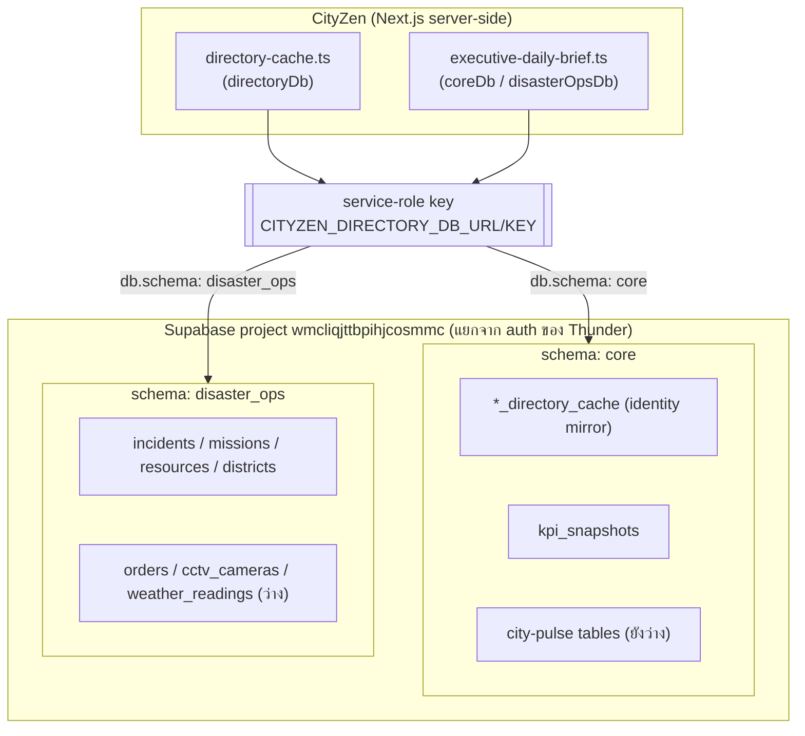
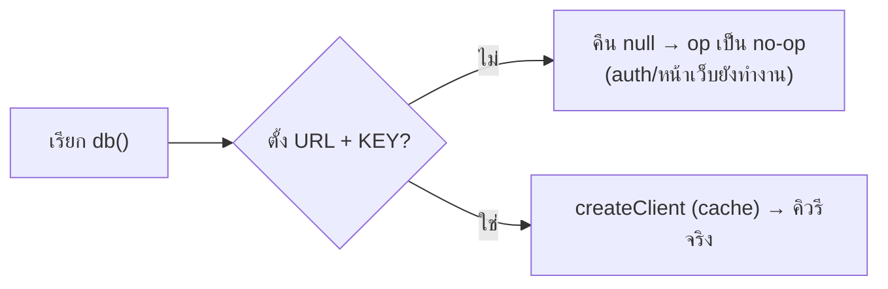
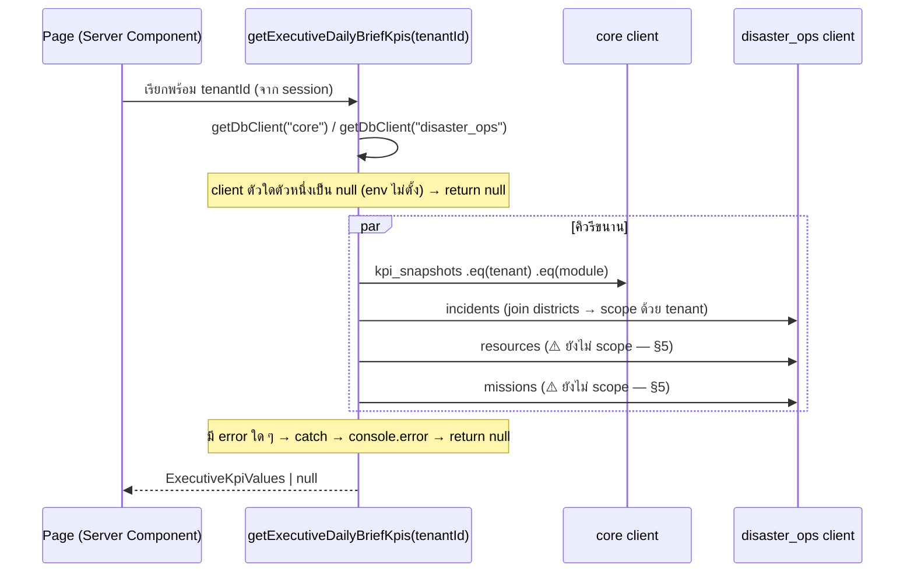

# DATA_ACCESS — การเชื่อมต่อฐานข้อมูลของ CityZen (Supabase Data-Plane)

> **สถานะ:** ณ วันที่ 13 ก.ค. 2026 (branch `fix/webhook`)
> **อ้างอิงโค้ด:** `src/lib/supabase-db.ts` (client factory กลาง), `src/lib/directory-cache.ts`, `src/lib/executive-daily-brief.ts`, `src/types/database.types.ts`
> **เอกสารพี่น้อง:** [`AUTHENTICATION_FLOW.md`](AUTHENTICATION_FLOW.md) = auth/session/RBAC · [`AUTH_CONTRACT.md`](AUTH_CONTRACT.md) = สัญญากลาง Thunder↔CityZen — ถ้าค่าในไฟล์นี้ขัดกับโค้ด ให้ยึดโค้ด แล้วแก้ทั้งสองที่ใน PR เดียว

---

## 0. สิ่งที่เอกสารนี้ **ไม่ครอบคลุม**

เอกสารนี้พูดถึง **data-plane** เท่านั้น — คือการอ่าน/เขียนข้อมูล domain + directory cache ผ่าน service-role client ไม่ใช่เรื่อง auth

| หัวข้อ                                          | อยู่ในเอกสารนี้ไหม | อยู่ที่ไหน                          |
| ---------------------------------------------- | ------------------ | ---------------------------------- |
| อ่าน/เขียน DB ด้วย `@supabase/supabase-js` (service-role) | ✅ ใช่               | ที่นี่                              |
| Auth Supabase client (`src/utils/supabase/client.ts`, `server.ts`, `@supabase/ssr`) | ❌ ไม่               | ดู [`AUTHENTICATION_FLOW.md`](AUTHENTICATION_FLOW.md) §0 — และจริง ๆ CityZen **แทบไม่ได้ใช้** client ตัวนี้ (identity เป็นของ Thunder) |
| การพิสูจน์ตัวตน / session / RBAC / liveness      | ❌ ไม่               | [`AUTHENTICATION_FLOW.md`](AUTHENTICATION_FLOW.md) |
| Webhook receiver (Thunder→CityZen)             | บางส่วน (เขียน cache) | [`AUTHENTICATION_FLOW.md`](AUTHENTICATION_FLOW.md) §9 |

> **หมายเหตุสำคัญ:** ในโค้ดมี Supabase อยู่ **2 หน้า** — (1) `@supabase/ssr` (anon key + cookie) สำหรับ auth ที่แทบไม่ใช้ กับ (2) `@supabase/supabase-js` (service-role key) สำหรับ data-plane เอกสารนี้ = ตัว (2) เท่านั้น อย่าเอา 2 อันปนกัน

---

## 1. ภาพรวมสถาปัตยกรรม

- CityZen ต่อ **Supabase project เดียว** สำหรับ data (project id `wmcliqjttbpihjcosmmc`) — **คนละ project กับ auth ของ Thunder**
- Project นี้มี **2 schema** ที่โค้ดแตะ: `core` และ `disaster_ops` (ตารางจริงอยู่นอก `public`)
- ต่อด้วย **service-role key** ตัวเดียว (`CITYZEN_DIRECTORY_DB_URL` / `CITYZEN_DIRECTORY_DB_KEY`) → **ข้าม RLS ทั้งหมด** (ดู §4)
- ต่อผ่าน `@supabase/supabase-js` ล้วน (ไม่ใช่ `@supabase/ssr`) — ไม่มี cookie, ไม่มี session (`persistSession: false`)



---

## 2. รูปแบบการเชื่อมต่อ (Connection Pattern)

**จุดต่อ DB มีที่เดียว:** `src/lib/supabase-db.ts` → `getDbClient(schema)` ทุกโมดูลที่อ่าน DB เรียกผ่านตัวนี้ (ไม่มีใครเรียก `createClient` เอง) — สร้าง client **ครั้งเดียวต่อ schema (cache ใน `Map`)** แล้วใช้ซ้ำ ผูก 1 client ต่อ 1 schema ผ่าน `db.schema`, typed ด้วย `Database` จาก `database.types.ts`

```ts
// src/lib/supabase-db.ts
type AppSchema = Extract<keyof Database, "core" | "disaster_ops">;
const clients = new Map<AppSchema, SupabaseClient<Database, AppSchema> | null>();

export function getDbClient<S extends AppSchema>(schema: S): SupabaseClient<Database, S> | null {
  const memo = clients.get(schema);
  if (memo !== undefined) return memo as SupabaseClient<Database, S> | null;   // สร้างแล้ว → ใช้ซ้ำ
  const url = process.env.CITYZEN_DIRECTORY_DB_URL;
  const key = process.env.CITYZEN_DIRECTORY_DB_KEY;
  const client = url && key
    ? createClient(url, key, { auth: { persistSession: false }, db: { schema } }) as unknown as SupabaseClient<Database, S>
    : null;                                                                     // ไม่ตั้ง env → null (no-op)
  clients.set(schema, client as SupabaseClient<Database, AppSchema> | null);
  return client;
}
```

- `directory-cache.ts` → `getDbClient("core")` · `executive-daily-brief.ts` → `getDbClient("core")` + `getDbClient("disaster_ops")`
- `persistSession: false` — ไม่มี session/cookie เป็น backend-to-DB ล้วน

### 2.1 Config seam — "build now, plug link later"

ถ้า **ไม่ได้ตั้ง** `CITYZEN_DIRECTORY_DB_URL/KEY` → `db()` คืน `null` → ทุก data op เป็น **no-op** (cache ไม่เขียน, KPI คืน `null`) โดย **ไม่ล้มทั้งแอป** ทำให้ dev ทำงานได้โดยไม่ต้องมี DB จริง แล้วค่อยเสียบ env ทีหลัง — โค้ดไม่ต้องแก้



### 2.2 Read path (ตัวอย่าง executive daily brief)



---

## 3. Schema & ตาราง

### 3.1 `core`

| กลุ่ม                 | ตาราง                                                                                       | มีข้อมูลจริง?          |
| --------------------- | ------------------------------------------------------------------------------------------- | ---------------------- |
| Directory cache (identity mirror ของ Thunder — ดู AUTH_FLOW §5.4) | `user_directory_cache`, `tenant_directory_cache`, `membership_directory_cache`, `department_directory_cache` | ✅ มี (seed จาก login/webhook) |
| KPI                   | `kpi_snapshots`                                                                             | ✅ มี (city_pulse module) |
| City-pulse domain     | `messages`, `decisions`, `projects`, `ai_recommendations`, `sentiment_records`, `notifications`, `appointments`, `impact_forecasts`, ฯลฯ | ⬜ ตารางมีแล้วแต่ **ยังว่าง** (mock อยู่ใน `mock.ts` ต่อ feature) |

### 3.2 `disaster_ops`

| ตาราง                                                              | มีข้อมูลจริง? |
| ----------------------------------------------------------------- | ------------- |
| `incidents`, `missions`, `resources`, `districts`, `severity_levels`, `incident_categories` | ✅ มี (demo seed) |
| `resource_allocations`, `orders`, `cctv_cameras`, `weather_readings` | ⬜ ว่าง        |

> ตาม Data Policy ใน CLAUDE.md — หน้าที่ยังไม่ wire ใช้ `mock.ts` ต่อ feature ตารางว่างข้างบนคือ schema ที่เตรียมไว้ แต่ยังไม่มีข้อมูล/ยังไม่ต่อ

---

## 4. โมเดลความปลอดภัย (Security)

**หัวใจ:** ทุกตารางเปิด `rls_enabled = true` **แต่ service-role key ข้าม RLS ทั้งหมด** → RLS **ไม่ได้**บังคับ tenant isolation ให้เลย

> **Tenant isolation อยู่ "ในคิวรี" ไม่ใช่ใน RLS** — ถ้าคิวรีไหนลืมใส่ tenant filter = อ่านข้าม tenant ได้ทันที ไม่มีอะไรกันชั้นสอง

การ scope ต่อ tenant ที่ทำจริงในโค้ด:

| ตาราง            | วิธี scope                                                                 |
| ---------------- | ------------------------------------------------------------------------- |
| `kpi_snapshots`  | `.eq("thundercore_tenant_id", tenantId)` ตรง ๆ                            |
| `incidents`      | join `districts!inner(thundercore_tenant_id)` แล้ว `.eq("districts.thundercore_tenant_id", tenantId)` (incidents เองไม่มี tenant_id ตรง ๆ) |
| directory cache  | คิวรีด้วย `(thundercore_user_id, thundercore_tenant_id)` เสมอ (ดู AUTH_FLOW §6.3) |

**กฎเหล็กเวลาเพิ่มคิวรีใหม่:** service-role = ไม่มีตาข่ายกันตก ต้องใส่ tenant filter เองทุกครั้ง อย่าลอกคิวรีที่ยังไม่ scope (ดู §5)

---

## 5. ⚠️ ช่องโหว่ tenant-scoping (resources / missions)

ใน `executive-daily-brief.ts` มี `ponytail:` comment กำกับไว้ตรง ๆ:

- คิวรี **`resources`** และ **`missions`** **ยังไม่ได้ scope ต่อ tenant** — อ่านทั้งตารางข้ามทุก tenant
- สาเหตุ: ทั้งสองตารางมีคอลัมน์ `thundercore_department_id` แต่ **null ทุกแถวที่ seed** (ยืนยัน 13 ก.ค. 2026) → ยังไม่มี join path ให้ scope
- การแก้ต้องตัดสินใจเชิง data-model ก่อน (ใครเป็นคนผูก resource/mission เข้ากับ department?) ไม่ใช่แค่แก้คิวรี
- **ตอนนี้ถูกบังไว้** เพราะ demo เป็น tenant เดียว — พอมี tenant ที่สองเมื่อไหร่ ตัวเลข readiness/missions จะรวมข้าม tenant ทันที

> **อย่าลอก pattern คิวรี resources/missions ไปใช้ที่อื่น** จนกว่าจะปิดช่องนี้ — incidents/kpi ต่างหากที่เป็นตัวอย่างที่ scope ถูก

---

## 6. การรวม client factory (แก้แล้ว)

เดิมมีหนี้ 2 อย่าง (client factory ซ้ำ + `executive-daily-brief` ไม่ typed) — **รวมเสร็จแล้ว:**

- **Factory กลางที่เดียว:** ทั้ง `directory-cache.ts` และ `executive-daily-brief.ts` เรียก `getDbClient(schema)` จาก `supabase-db.ts` ไม่มีใครสร้าง `createClient` เอง
- **Typed ทั้งคู่:** `database.types.ts` ครอบ `core` (directory cache + `kpi_snapshots`) และ `disaster_ops` (`districts`/`incidents`/`resources`/`missions`) → คิวรีทุกตัวเช็คชนิดกับ schema แล้ว

> **ข้อจำกัดที่เหลือ:** `database.types.ts` เขียนมือ ครอบเฉพาะ **ตารางที่โค้ดอ่านจริง** (ตารางว่างใน §3 ยังไม่มี type) — จะอ่านตารางใหม่ต้องเติม type ก่อน MCP `generate_typescript_types` ของ Supabase gen ได้แค่ schema `public` (ว่าง) จึงต้องเขียนมือจาก live schema

---

## 7. Error handling

หลักการเดียวกับ CLAUDE.md — **ไม่ปล่อย raw error จาก Supabase ออก frontend**

| จุด                                   | เกิดอะไร                          | ผล                                              |
| ------------------------------------- | -------------------------------- | ----------------------------------------------- |
| `getExecutiveDailyBriefKpis`          | คิวรีพัง (`error`) หรือ client เป็น null | `catch` → `console.error` ฝั่ง server → **คืน `null`** (หน้า render แบบ empty/safe) |
| `upsertDirectorySnapshot` (cold populate) | เขียน cache พัง                    | throw ออกมา → caller เรียกแบบ **fire-and-forget** (`.catch` log) → **ไม่ block login** (AUTH_FLOW §5.4) |
| `checkMembershipLiveness`             | คิวรี error (DB ต่อได้แต่ call พัง) | **fail closed** (allow=false) — ต่างจาก "ไม่มี row" ที่ fail open (AUTH_FLOW §6.3) |

> จับ error → log ฝั่ง server → คืนค่า fallback (null / no-op) ไม่โยน raw error ให้ผู้ใช้

---

## 8. Environment variables

| env                        | ใช้ทำอะไร                                                     |
| -------------------------- | ------------------------------------------------------------ |
| `CITYZEN_DIRECTORY_DB_URL` | base URL ของ Supabase data project (`wmcliqjttbpihjcosmmc`)  |
| `CITYZEN_DIRECTORY_DB_KEY` | **service-role key** — ข้าม RLS · เก็บฝั่ง server เท่านั้น ห้ามหลุด client |

- **แยก failure domain จาก auth:** project/คีย์ชุดนี้ **คนละตัว**กับ `NEXT_PUBLIC_SUPABASE_*` (auth ของ Thunder) และ `SUPABASE_JWT_SECRET` — data ล่มไม่กระทบ auth และกลับกัน
- ไม่ตั้ง 2 ตัวนี้ → data op เป็น **no-op** (ดู §2.1) auth/หน้าเว็บยังทำงานปกติ
- `KEY` เป็น service-role (สิทธิ์เต็ม ข้าม RLS) → **ต้องอยู่ฝั่ง server เท่านั้น** ไม่มี prefix `NEXT_PUBLIC_` เด็ดขาด
